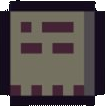
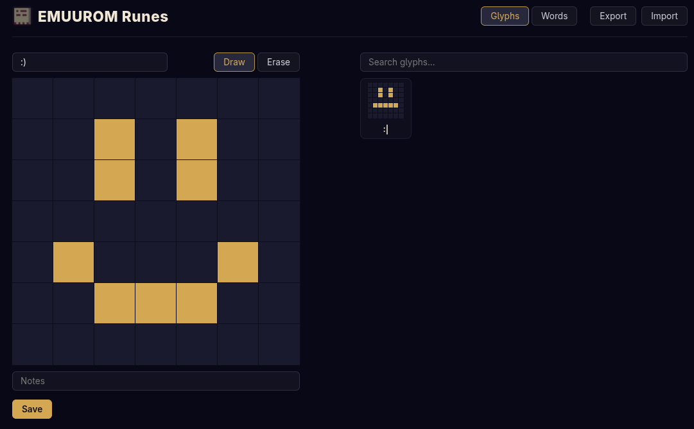
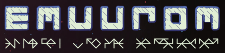
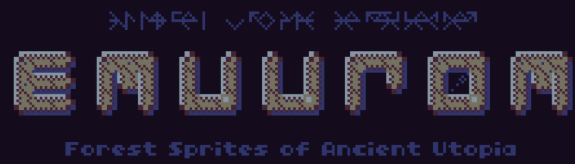
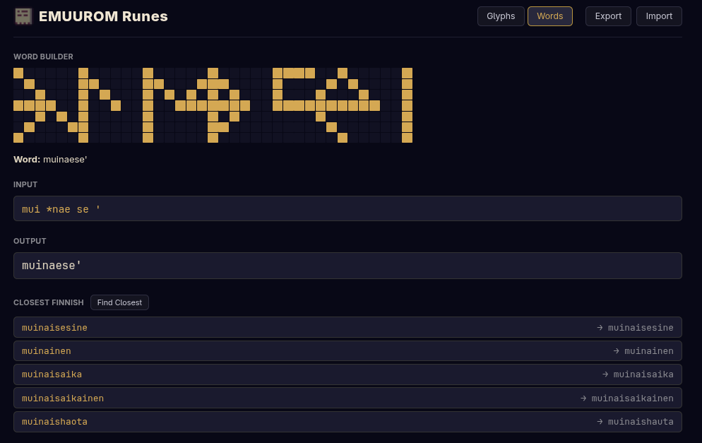
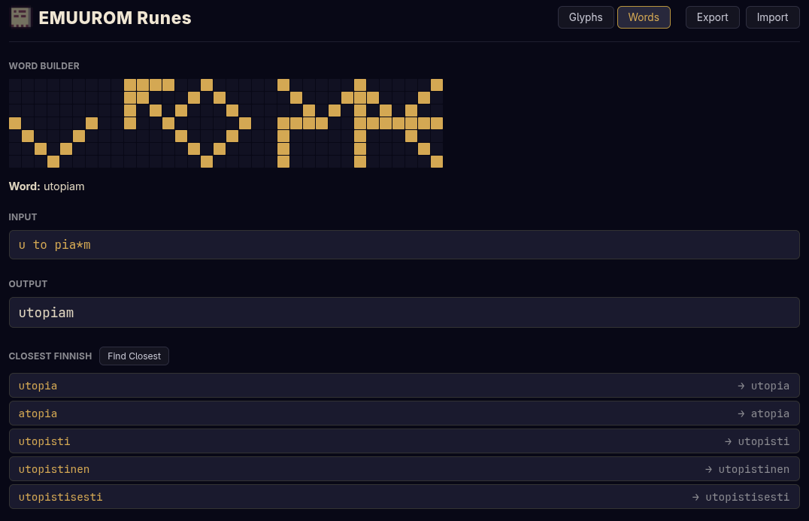
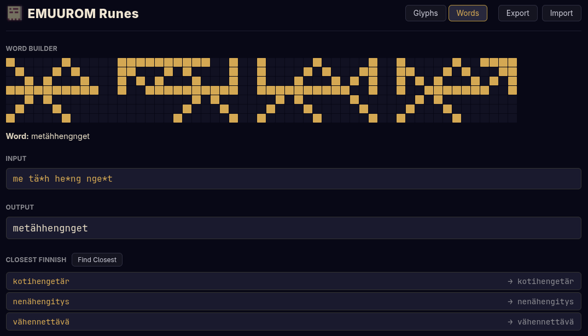

<h1 style="display: flex;align-items: center">
  
  emuurom-runes
</h1>

> **⚠️ SPOILER WARNING** — [EMUUROM](https://store.steampowered.com/app/1634360/EMUUROM/) is game about exploration and discovery. This repository reveals part of game's rune puzzle. Read on at your own risk.

Decode symbols, compose rune-words, find translations. Companion for the language puzzle.

🌐 **Live:** [emuurom-runes.vercel.app](https://emuurom-runes.vercel.app/)

[](https://github.com/esauflores/emuurom-runes/actions/workflows/ci.yml)

## Find Runes



## Find translations

**muinaese' utopiam metähhengnget** — "Forest Sprites of Ancient Utopia"

<table>
  <tr>
    <td></td>
    <td></td>
  </tr>
</table>
<table>
  <tr>
    <td></td>
    <td></td>
    <td></td>
  </tr>
</table>

# Technical

## Quick start

```bash
# Web UI (edit glyphs, compose words)
cd webapp
pnpm install
pnpm dev

# CLI word bank builder
cd extractor
uv sync
just build
just fi "kirjur'"
```

## How it works

1. Draw 7×7 pixel glyphs in the editor, assign Finnish letters
2. Compose rune-words by typing glyph letters or clicking them
3. Search closest Savo-ish Finnish word in a 93K-entry bank
4. Iterate — discover what unknown rune-sequences might mean

## Project layout

| Directory    | Purpose                                           |
|-------------|---------------------------------------------------|
| webapp/    | React UI — glyph editor + word builder + search    |
| extractor/ | Python — build Savo-ish word bank from Kotus list  |

See each directory's README for technical details.
